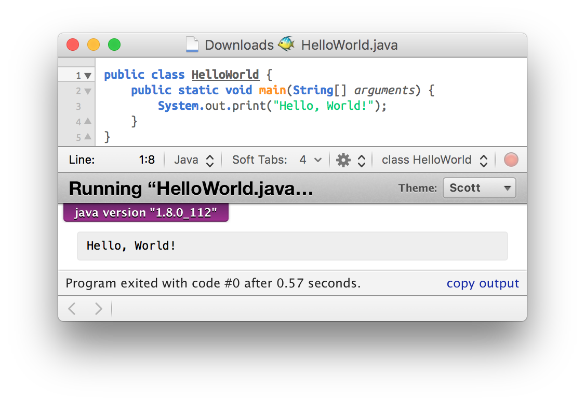
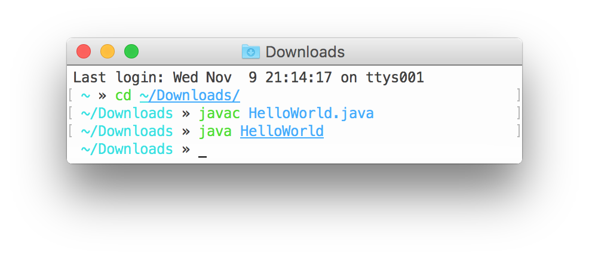

# Einführung

- Ein **ausführbares Progamm** besteht üblicherweise aus so-genannten **Maschinen-Befehlen** die direkt von der CPU (Prozessor) des Computers ausgeführt werden. Im Endeffekt handelt es sich bei diesen Maschinen-Befehlen einfach um eine Folge von Zahlen (64bit lang bei aktuellen Intel-Prozessoren), wobei den Zahlen unterschiedliche Bedeutungen zugewiesen werden.

- Theoretisch könnte man ein Programm also auch „einfach“ erstellen indem man die richtigen Zahlen ermittelt  und diese in einen sogenannten Hex-Editor (siehe Screenshot) eintippt. Das unten stehende Bild zeigt beispielsweise Teile eines ausführbaren „Hello World“-Programms – also eines Programms, dass den Satz „Hello, World!“ auf dem Bildschirm ausgibt.

  

  Die Zahlen im obigen Screenshot werden dabei, in dem in der Informatik üblichen Hexadezimal-System (Basis 16 – mögliche Ziffern:`0–F (0–15)`), dargestellt.  Natürlich könnte man die obigen Zahlen auch im Dezimalsystem anzeigen. Der Wert `2C` in Hexadezimal-System entspricht z.B. der Dezimalzahl `44` (`2·16¹ + 12·16⁰`).

- Wie das Wort “Befehl” in Maschinen-Befehle schon andeutet besteht ein Programm aus **Anweisungen** an den Computer der dieser der Reihe nach – 1. Befehl, 2. Befehl, 3. Befehl usw. –  ausführt. Weiters gibt es auch Befehle die den **Programmfluss** (die Reihenfolge in der Befehle) ausgeführt werden ändern können.

- Als Entwickler arbeitet man üblicherweise nicht direkt im Hex-Editor sondern entwickelt in einer mehr (Python, Ruby) oder weniger abstrakten Programmiersprache (C, Assembler) in einem **Text-Editor**. Der **Code**  in diesen Programmiersprachen wird dann im Maschinen-Befehle übersetzt (**kompiliert**) oder direkt von einem anderen Programm – einem sogenannten Interpreter – ausgeführt (**interpretiert**). Der unten stehende Text in der Programmiersprache C zeigt den Code der in das ausführbare “Hello, World!”-Programm – zu sehen im obigen Screenshot – umgewandelt wurde.

  ```c
  #include <stdio.h>

  int main (int argc, char const *argv[])
  {
    // Gib `Hello, World!` auf dem Bildschirm aus
    printf("Hello, World!");
    return 0;
  }
  ```

  Hier noch zwei Beispiele von Codes für ein „Hello World“-Programm in den Programmiersprachen Python:

  ```py
  print("Hello, World!")
  ```

  und Ruby:

  ```rb
  puts "Hello, World!"
  ```

  .

# Ein Erstes Beispiel-Programm

Das klassische Beispiel für einen erstes Programm stellt [“Hello, World!”][] dar.  Im vorigen Abschnitt  wurden einige Beispiel-Implementierungen in verschiedenen Programmiersprachen gezeigt. Nun widmen wir uns der Implementierung des Programmes in der Sprache Java.  Der unten stehende  Code zeigt die übliche Variante:

```java
public class HelloWorld {
    public static void main(String[] arguments) {
        System.out.println("Hello, World!");
    }
}
```


Um den obigen Code zu übersetzen sollte man ihn in einem Texteditor wie z.B. [TextMate][] kopieren und unter dem Namen `HelloWorld.java` speichern. Der Name der Datei muss also mit dem Namen der Klasse – dem Text nach `class` – übereinstimmen!

[“Hello, World!”]: https://en.wikipedia.org/wiki/%22Hello,_World!%22_program
[TextMate]: https://github.com/textmate/textmate

In manchen Editoren wie zum Beispiel [TextMate][] lässt sich das Progamm dann direkt übersetzen und ausführen (<kbd>⌘</kbd> + <kbd>R</kbd>):



Fall der Texteditor diese Funktion nicht unterstützt kann man das Progamm auch in einem Terminal-Programm übersetzen und ausführen. Dazu wechselt man als erstes mittels des Befehls `cd` in den Ordner in dem sich die Datei `HelloWorld.java` befindet. Wenn wir annehmen, dass sich die Datei in dem Ordner `~/Downloads` befindet – `~` steht für den Ordner des aktuellen Benutzers – dann lautet der Befehl zum Wechseln ins richtige Verzeichnis:

```sh
cd ~/Downloads
```

. Zum Übersetzen (Kompilieren) des Programms verwendet man den Befehl `javac Dateiname.java`:

```sh
javac HelloWorld.java
```

. Nachdem dem erfolgreichen Übersetzungsprozess enthält der aktuelle Ordner eine neue Datei mit dem Namen `HelloWorld.class`. Diese Datei kann man dann mittels des Befehls `java` ausführen:

```sh
java HelloWorld
```

. Der unten stehende Screenshot zeigt diese Schritte nochmals zusammengefasst.


